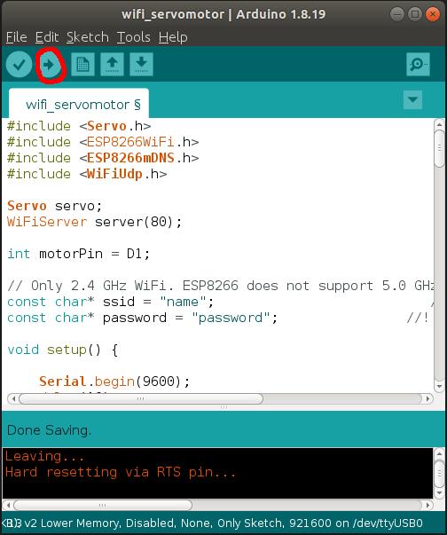
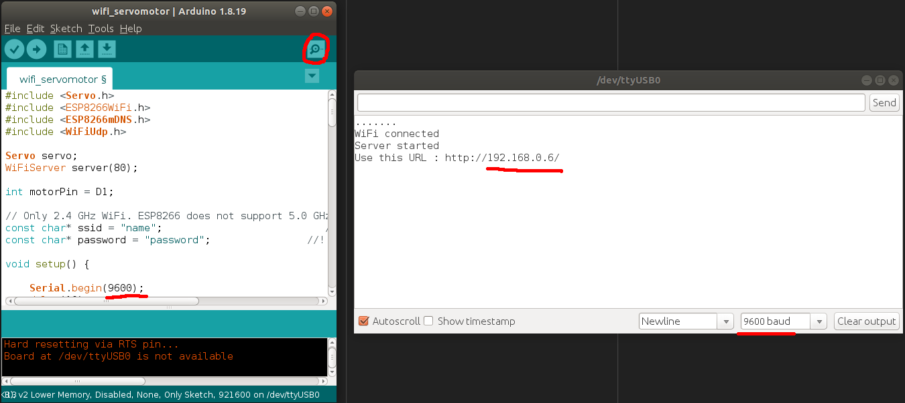

# Issues
- Access to fetch at 'http://private.network/ON' from origin 'http://public.network:3000' has been blocked by CORS policy: The request client is not a secure context and the resource is in more-private address space `private`.
  - https://stackoverflow.com/questions/66534759/cors-error-on-request-to-localhost-dev-server-from-remote-site

# Install
- Arduino IDE
  - https://docs.arduino.cc/software/ide-v1/tutorials/Linux

# Setup
## Transfer code to ESP8266 D1 Mini
In a terminal  
- `arduino src/wifi_servomotor/wifi_servomotor.ino`  
  
Put the correct WiFi name and password in the [code](src/wifi_servomotor/wifi_servomotor.ino)  
And press the red one.  


# Test
## Get to know the ESP8266 D1 Mini ip address
Press the red circle and check the red lines. 9600 is how you will see the log. Sort of channel?


## Terminal
Try simply
```
wget <your device ip>/ON
wget <your device ip>/OFF
wget <your device ip>/MIDDLE
```
- e.g., `wget 192.168.0.6/ON`
# Links to refer
- Servo motor : https://www.youtube.com/watch?v=tlgLA-PT5eE
- Arduino IDE installation : https://docs.arduino.cc/software/ide-v1/tutorials/Linux
- Install ESP8266 Boards Manager and libraries : 
  - https://arduino-esp8266.readthedocs.io/en/latest/installing.html
  - https://github.com/esp8266/source-code-examples/issues/26#issuecomment-320999460
- WiFi connection : https://www.youtube.com/watch?v=utKpl1Z4nEM&ab_channel=logMaker360
- Issues
  - Permission :  https://github.com/esp8266/source-code-examples/issues/26#issuecomment-320999460
- 
